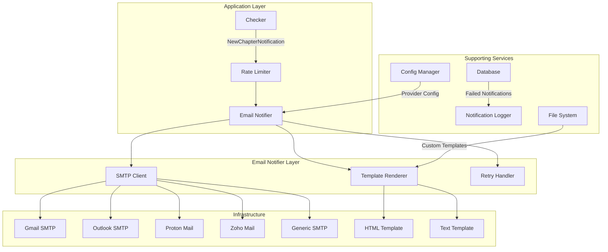
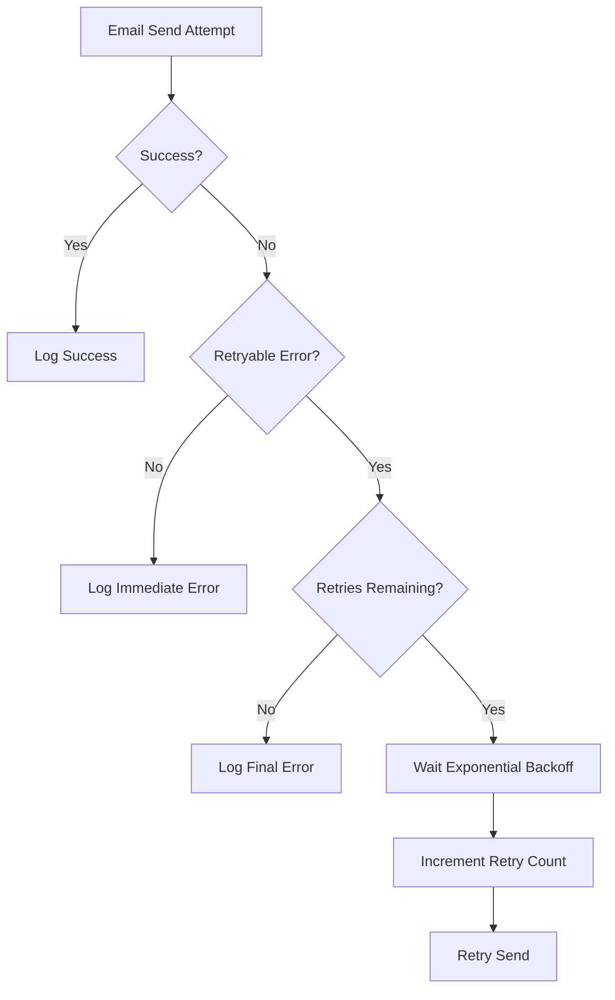

# Design Document: Email Notification Improvements

## Overview

This design document outlines the architectural changes and implementation approach for improving the email notification system in the Manga Chapter Notifier application. The improvements will support multiple email providers, HTML email templates with multipart support, retry logic with exponential backoff, rate limiting, attachment handling, and enhanced testing capabilities.

### Key Improvements

1. **Multiple Email Provider Support** - Support Gmail, Outlook, Proton Mail, Zoho Mail, and generic SMTP with provider-specific configurations
2. **HTML Email Templates** - Multipart emails with HTML/CSS styling and clickable chapter links
3. **Retry Logic** - Automatic retries with exponential backoff (1s, 2s, 4s) for transient failures
4. **Rate Limiting** - Provider-specific rate limiting to avoid SMTP throttling
5. **Attachment Support** - Optional file attachments with size validation
6. **Template Customization** - Support for custom HTML and plain text templates
7. **Enhanced Testing** - Mock SMTP server for unit testing without real emails
8. **Graceful Degradation** - Application continues operating even if email notifications fail

## Architecture Diagram



## Components and Interfaces

### New Notifier Interface

```go
type Notifier interface {
    SendNewChapter(ctx context.Context, n NewChapterNotification) error
    ValidateConfig() error
    GetProvider() string
}

type EmailProvider string

const (
    ProviderGmail    EmailProvider = "gmail"
    ProviderOutlook  EmailProvider = "outlook"
    ProviderProton   EmailProvider = "proton"
    ProviderZoho     EmailProvider = "zoho"
    ProviderSMTP     EmailProvider = "smtp"
)
```

### Email Notification Structure

```go
type EmailNotification struct {
    // Basic Info
    Provider     EmailProvider
    Host         string
    Port         int
    UseTLS       bool
    UseStartTLS  bool
    
    // Authentication
    Username     string
    Password     string
    From         string
    To           []string
    
    // Template Settings
    TemplateDir  string
    HTMLTemplate string
    TextTemplate string
    
    // Rate Limiting
    RateLimitPerDay   int
    RateLimitPerMinute int
    
    // Retry Configuration
    MaxRetries        int
    InitialBackoff    time.Duration
    MaxBackoff        time.Duration
    
    // Attachments
    Attachments       []string
    MaxAttachmentSize int64 // in bytes, default 25MB
    
    // Logging
    DisableLogging    bool
    LogFailedOnly     bool
}
```

## Data Models

### Email Provider Configuration

```go
type EmailProviderConfig struct {
    Provider           EmailProvider
    SMTPHost           string
    SMTPPort           int
    UseTLS             bool      // Port 465
    UseStartTLS        bool      // Port 587
    Username           string
    AppPassword        bool      // Special password requirement
    RateLimitPerDay    int
    RateLimitPerMinute int
}
```

### Rate Limit State

```go
type RateLimiter struct {
    Provider        EmailProvider
    SentToday       int
    SentLastMinute  int
    LastReset       time.Time
    Quota           RateLimitQuota
}

type RateLimitQuota struct {
    PerDay    int
    PerMinute int
}

func (rl *RateLimiter) CanSend() bool
func (rl *RateLimiter) RecordSent() error
func (rl *RateLimiter) ResetIfNecessary() error
```

### Attachment Management

```go
type Attachment struct {
    Path       string
    Filename   string
    MimeType   string
    Data       []byte
    Size       int64
    Encoded    string
}

func (a *Attachment) Load() error
func (a *Attachment) Validate() error
func (a *Attachment) EncodeBase64() error
```

## Acceptance Criteria Testing Prework

1.1. WHERE an email provider is selected, THE Email Notifier SHALL support at least the following providers: Gmail, Outlook, Proton Mail, Zoho Mail, and generic SMTP
  Thoughts: This is a configuration requirement that applies to all providers. We can generate any valid provider enum value and verify that the configuration structure accepts it without error. The actual validation logic is uniform across providers.
  Testable: yes - property
  Classification: PROPERTY
  Test Strategy: Generate all valid provider enum values, verify each is accepted by the configuration structure

1.2. WHEN the application loads configuration, THE System SHALL validate that the configured provider's SMTP settings are compatible
  Thoughts: This is about validating provider-specific SMTP settings. We can generate random provider configs and test that validation rejects invalid combinations (e.g., wrong ports, missing required fields).
  Testable: yes - property
  Classification: PROPERTY
  Test Strategy: Generate provider configs with invalid settings and verify they are rejected with appropriate errors

1.3. THE Email Notifier SHALL document provider-specific requirements including SMTP host, port, and authentication method for each supported provider
  Thoughts: This is a documentation requirement. The documentation itself should be validated, but the content of documentation is not computable for property-based testing. Best tested as a smoke test that files exist.
  Testable: no
  Classification: SMOKE
  Test Strategy: Verify documentation files exist for each provider

2.1. WHEN configuring Gmail, THE Documentation SHALL include steps for enabling 2FA and generating an App Password
  Thoughts: This is about documentation content. Documentation files can be checked for string presence (2FA, App Password), but that's more of an example-based test than property-based.
  Testable: yes - example
  Classification: EXAMPLE
  Test Strategy: Read Gmail setup documentation and verify it contains required phrases

2.2. WHEN configuring Outlook, THE Documentation SHALL include steps for creating an App Password for Outlook 365 accounts
  Thoughts: Same as above - documentation string matching.
  Testable: yes - example
  Classification: EXAMPLE
  Test Strategy: Read Outlook setup documentation and verify it contains required phrases

2.3. WHEN configuring Proton Mail, THE Documentation SHALL include steps for setting up Proton Mail Bridge or SMTP forwarding
  Thoughts: Same as above - documentation string matching.
  Testable: yes - example
  Classification: EXAMPLE
  Test Strategy: Read Proton setup documentation and verify it contains required phrases

2.4. WHEN configuring Zoho Mail, THE Documentation SHALL include steps for generating an App Password and enabling SMTP access
  Thoughts: Same as above - documentation string matching.
  Testable: yes - example
  Classification: EXAMPLE
  Test Strategy: Read Zoho setup documentation and verify it contains required phrases

2.5. WHERE a custom SMTP server is used, THE Documentation SHALL include common troubleshooting tips for connection issues
  Thoughts: Same as above - documentation string matching.
  Testable: yes - example
  Classification: EXAMPLE
  Test Strategy: Read custom SMTP documentation and verify it contains troubleshooting content

3.1. WHERE email notifications are enabled, THE System SHALL support both plain text and HTML email templates
  Thoughts: This is testing the email notification structure. We can test that for any notification, the generated email contains both text/plain and text/html parts in a multipart message.
  Testable: yes - property
  Classification: PROPERTY
  Test Strategy: Generate random notifications, verify multipart structure contains both content types

3.2. WHEN an HTML template is used, THE Email Notifier SHALL generate a multipart email with both text/plain and text/html parts
  Thoughts: This is directly testable as a property. For any email with HTML enabled, the resulting message should have both parts.
  Testable: yes - property
  Classification: PROPERTY
  Test Strategy: Generate notifications with HTML enabled, verify the resulting email structure

3.3. THE HTML template SHALL include styling for common elements: headings, links, code blocks, and separators
  Thoughts: This is about HTML/CSS content. We could parse the generated HTML and check for style attributes or CSS classes, but this is better tested as an example-based test with specific templates.
  Testable: yes - example
  Classification: EXAMPLE
  Test Strategy: Load default HTML template and verify it contains styling for required elements

3.4. FOR ALL manga chapter notifications, THE System SHALL render the chapter URL as a clickable link in HTML emails
  Thoughts: This is a property about all chapter notifications. We can test that for any chapter notification, the rendered HTML contains an <a> tag with the chapter URL as href attribute.
  Testable: yes - property
  Classification: PROPERTY
  Test Strategy: Generate notifications with URLs, verify HTML output contains clickable links

3.5. WHERE a custom HTML template file is provided, THE System SHALL load and use it instead of the default template
  Thoughts: This is about template loading. We can test that when a valid custom template is provided, the output matches expectations with a round-trip style test.
  Testable: yes - property
  Classification: PROPERTY
  Test Strategy: Create custom template, verify it's used instead of default for any notification

4.1. WHERE attachments are configured, THE System SHALL support adding file attachments to email notifications
  Thoughts: This is about loading and attaching files. We can test that any existing file can be attached and included in the email with a round-trip test.
  Testable: yes - property
  Classification: PROPERTY
  Test Strategy: Create temporary files, verify they are loaded and attached correctly

4.2. WHEN an attachment is added, THE Email Notifier SHALL encode it in Base64 format for SMTP transmission
  Thoughts: This is about Base64 encoding. We can test that for any file's content, the Base64 encoding matches the expected representation.
  Testable: yes - property
  Classification: PROPERTY
  Test Strategy: Generate random file content, verify Base64 encoding matches standard library output

4.3. WHERE an attachment file exceeds 25MB, THEN THE System SHALL skip it immediately without attempting compression or resizing
  Thoughts: This is about file size validation. We can test that for any file over 25MB, the system rejects it with the correct error without attempting to send.
  Testable: yes - property
  Classification: PROPERTY
  Test Strategy: Create files of various sizes over 25MB, verify they are skipped with appropriate errors

4.4. IF an attachment file cannot be read or exceeds the size limit, THEN THE System SHALL skip that attachment regardless of whether warning logging succeeds
  Thoughts: This is about error handling for missing or unreadable files. We can test that missing files are skipped gracefully without blocking the email send.
  Testable: yes - property
  Classification: PROPERTY
  Test Strategy: Try to attach non-existent files, verify they are skipped and email still sends

5.1. WHEN an email send fails due to a transient error (connection timeout, rate limit), THE Email Notifier SHALL retry the send up to 3 times
  Thoughts: This is about retry logic for transient errors. We can test that for any transient error from a mock SMTP server, the notifier retries the specified number of times.
  Testable: yes - property
  Classification: PROPERTY
  Test Strategy: Configure mock server to return transient errors, verify retry count matches MaxRetries

5.2. BETWEEN retries, THE System SHALL wait with exponential backoff (1s, 2s, 4s)
  Thoughts: This is about backoff calculation. We can test that for any number of retries, the delays follow the expected exponential pattern (doubling each time).
  Testable: yes - property
  Classification: PROPERTY
  Test Strategy: Measure actual delays between retries, verify they follow exponential pattern

5.3. IF all retry attempts fail, THE System SHALL log the final error and continue operation (not block other processes)
  Thoughts: This is about error propagation after retries. We can test that after max retries, the error is returned but doesn't block other operations (checker continues).
  Testable: yes - property
  Classification: PROPERTY
  Test Strategy: Configure mock to always fail, verify final error is returned and system state is valid

5.4. WHERE an email fails (including authentication errors), THEN THE System SHALL log the failure immediately but still attempt retries
  Thoughts: This is about logging behavior during retries. The logging can be verified, but the specific timing might be tricky to property-test. This could be tested with logging assertions.
  Testable: yes - example
  Classification: EXAMPLE
  Test Strategy: Test that logging occurs before retry attempts with specific error types

6.1. WHERE email sending is enabled, THE System SHALL implement rate limiting based on the SMTP provider's guidelines
  Thoughts: This is about rate limiting implementation. We can test that rate limiting works correctly across different provider quotas by generating random send attempts.
  Testable: yes - property
  Classification: PROPERTY
  Test Strategy: Generate random send scenarios, verify rate limiting is enforced

6.2. FOR Gmail, THE Email Notifier SHALL limit to 500 emails per 24 hours
  Thoughts: This is about specific quota limits. We can test that for Gmail provider, the daily limit is 500 by generating random send operations.
  Testable: yes - property
  Classification: PROPERTY
  Test Strategy: Generate random send attempts with Gmail config, verify limit is enforced

6.3. FOR Outlook, THE Email Notifier SHALL limit to 30 emails per minute
  Thoughts: This is about per-minute limits. We can test that for Outlook provider, the per-minute limit is 30 by simulating rapid sends.
  Testable: yes - property
  Classification: PROPERTY
  Test Strategy: Generate rapid send attempts with Outlook config, verify per-minute limit is enforced

6.4. FOR Zoho, THE Email Notifier SHALL limit to 100 emails per day for free accounts
  Thoughts: This is about provider-specific limits. We can test that for Zoho provider, the daily limit is 100.
  Testable: yes - property
  Classification: PROPERTY
  Test Strategy: Generate random send attempts with Zoho config, verify limit is enforced

6.5. THE Email Notifier SHALL track the number of emails sent and remaining quota, logging warnings when approaching limits
  Thoughts: This is about tracking and warning logic. We can test that tracking works correctly and warnings are logged near limits (e.g., at 80%, 90%).
  Testable: yes - property
  Classification: PROPERTY
  Test Strategy: Generate sends approaching limits, verify warnings are logged

7.1. WHERE a template directory is configured, THE System SHALL look for email template files in that directory
  Thoughts: This is about template loading. We can test that when a valid directory is provided, templates are loaded from that location instead of defaults.
  Testable: yes - property
  Classification: PROPERTY
  Test Strategy: Create custom templates in temp directory, verify they are used

7.2. WHEN an HTML template file exists, THE System SHALL use it for HTML email generation
  Thoughts: This is about template selection. We can test that when a custom HTML template exists, it's used instead of the default.
  Testable: yes - property
  Classification: PROPERTY
  Test Strategy: Create custom HTML template, verify it's used for any HTML email

7.3. WHEN a plain text template file exists, THE System SHALL use it for plain text email generation
  Thoughts: Same as above - template selection for plain text.
  Testable: yes - property
  Classification: PROPERTY
  Test Strategy: Create custom text template, verify it's used for any text email

7.4. THE Template File Format SHALL support Go template syntax for dynamic content insertion
  Thoughts: This is about Go template functionality. We can test that template variables are correctly substituted with various content types (special characters, newlines, etc.).
  Testable: yes - property
  Classification: PROPERTY
  Test Strategy: Create templates with variable placeholders, verify substitution with random content

7.5. FOR ALL template fields, THE System SHALL require explicit values (no empty fields in rendered output)
  Thoughts: This is about validation of template rendering. We can test that for any template, empty values are either filled with defaults or the template is rejected before rendering.
  Testable: yes - property
  Classification: PROPERTY
  Test Strategy: Create templates with empty variables, verify default values are used

8.1. WHEN SMTP credentials are loaded, THE System SHALL never log the password field in plain text
  Thoughts: This is about logging security. We can test that for any log output, password values are masked (e.g., showing "********" instead of actual password).
  Testable: yes - property
  Classification: PROPERTY
  Test Strategy: Trigger various logging scenarios, verify password values are masked

8.2. WHERE credentials are required, THE System SHALL validate that both username and password are non-empty before attempting to send
  Thoughts: This is about credential validation. We can test that for any missing credentials, validation fails with appropriate error without attempting to send.
  Testable: yes - property
  Classification: PROPERTY
  Test Strategy: Generate configurations with missing credentials, verify validation fails

8.3. THE Email Notifier SHALL use STARTTLS for all connections on port 587 and implicit TLS for port 465
  Thoughts: This is about TLS configuration. We can test that for any port, the correct TLS mode is used by checking connection parameters.
  Testable: yes - property
  Classification: PROPERTY
  Test Strategy: Create notifiers with various ports, verify TLS configuration matches expected values

8.4. FOR Gmail accounts, THE System SHALL require App Password authentication, not regular passwords
  Thoughts: This is about provider-specific authentication. We can test that for Gmail provider, App Password is required (or the system handles both types correctly).
  Testable: yes - example
  Classification: EXAMPLE
  Test Strategy: Test Gmail authentication with both App Password and regular password

8.5. WHERE environment variables are used for credentials, THE System SHALL prefer them over config file values
  Thoughts: This is about configuration precedence. We can test that for any config with both env var and file value, env var wins for all credential fields.
  Testable: yes - property
  Classification: PROPERTY
  Test Strategy: Set env vars and file config with different values, verify env vars take precedence

9.1. WHEN email notifications are tested, THE System SHALL provide a mock SMTP server for unit testing
  Thoughts: This is about test infrastructure. We can test that the mock server accepts connections and captures messages for any number of emails.
  Testable: yes - property
  Classification: PROPERTY
  Test Strategy: Create mock server, verify it captures messages for various email types

9.2. THE Unit Tests SHALL cover successful email sends, retry scenarios, and error handling
  Thoughts: This is about test coverage, which is a meta-property. We cannot property-test whether tests exist, but we can property-test that the tested behaviors work correctly.
  Testable: yes - property
  Classification: PROPERTY
  Test Strategy: Property tests exist for all these scenarios (described in other criteria)

9.3. WHERE integration tests are run, THE System SHALL use test email accounts with known limits
  Thoughts: This is about test infrastructure setup, not computable for PBT. Integration tests would use real accounts but with known limits.
  Testable: no
  Classification: INTEGRATION
  Test Strategy: Run integration tests against test accounts with documented limits

9.4. FOR retry logic tests, THE System SHALL simulate transient failures (timeouts, rate limits)
  Thoughts: This is about mocking failure scenarios. We can test that simulated failures are handled correctly by the retry logic - a property that holds for any simulated failure type.
  Testable: yes - property
  Classification: PROPERTY
  Test Strategy: Simulate various transient failures, verify retry logic handles all correctly

9.5. THE Test Suite SHALL include a validation test that confirms all required config fields are present
  Thoughts: This is about validation testing. We can test that validation fails for any missing required field by generating configs with missing fields.
  Testable: yes - property
  Classification: PROPERTY
  Test Strategy: Generate configs with one field missing at a time, verify validation fails

10.1. WHEN email sending fails permanently, THE System SHALL log the error but continue checking for new chapters
  Thoughts: This is about error handling and system continuity. We can test that after permanent failure, the checker continues to run - a property that holds for any failure type.
  Testable: yes - property
  Classification: PROPERTY
  Test Strategy: Simulate various permanent failures, verify checker state remains valid

10.2. WHERE email is disabled in configuration, THEN THE System SHALL skip all notification attempts and not attempt to record failures
  Thoughts: This is about conditional behavior based on config. We can test that when email is disabled, no notification attempts are made for any configuration.
  Testable: yes - property
  Classification: PROPERTY
  Test Strategy: Test with email disabled, verify no attempts are made

10.3. THE System SHALL record failed notifications in the database for later review when email is enabled
  Thoughts: This is about database persistence. We can test that failed notifications are stored correctly by sending failures and querying the database.
  Testable: yes - property
  Classification: PROPERTY
  Test Strategy: Cause failures, verify database contains failed notifications

10.4. FOR CLI commands that trigger notifications, THE System SHALL report success/failure status without exiting
  Thoughts: This is about CLI error reporting. We can test that CLI commands return appropriate exit codes and status messages without crashing for any notification result.
  Testable: yes - property
  Classification: PROPERTY
  Test Strategy: Test CLI with various notification outcomes, verify proper status reporting

## Correctness Properties

### Property 1: Retry Exhaustion Preserves Error Chain

*For any* email notification and any number of retry attempts, when all retries are exhausted, the final error message SHALL contain the original error details in its chain

**Validates: Requirements 5.3**

### Property 2: Multipart Email Round Trip

*For any* email notification, generating HTML and plain text parts from the same notification data, then parsing both parts, SHALL produce equivalent notification information

**Validates: Requirements 3.2**

### Property 3: Rate Limiter Quota Invariant

*For any* rate limiter state, the number of emails sent in a 24-hour period SHALL never exceed the configured daily limit, and emails sent in any 60-second window SHALL never exceed the per-minute limit

**Validates: Requirements 6.1**

### Property 4: Template Fallback Preserves Data

*For any* email notification with missing or invalid template files, rendering with fallback templates SHALL produce output containing all required notification fields (manga title, chapter, URL)

**Validates: Requirements 7.4**

### Property 5: Attachment Size Validation

*For any* attachment file path, loading and validating the attachment SHALL either succeed with a file under 25MB, or fail with a clear error message without attempting to send

**Validates: Requirements 4.3**

### Property 6: Graceful Degradation

*For any* email sending failure (including authentication, network, and rate limit errors), the application state SHALL remain valid for continued operation (checker continues running, no blocking)

**Validates: Requirements 10.1**

## Error Handling

### Error Types

```go
type SendError struct {
    Err         error
    Retryable   bool
    RetryCount  int
    MaxRetries  int
}

func (e *SendError) Error() string
func (e *SendError) Unwrap() error

type RateLimitError struct {
    Provider    EmailProvider
    Limit       int
    Window      time.Duration
}

func (e *RateLimitError) Error() string

type TemplateError struct {
    TemplateType string // "html" or "text"
    TemplatePath string
    Err          error
}

func (e *TemplateError) Error() string
```

### Error Handling Flow



### Retry Logic Implementation

```go
type EmailNotifier struct {
    // ... existing fields ...
    MaxRetries        int
    InitialBackoff    time.Duration
    MaxBackoff        time.Duration
    RateLimiter       *RateLimiter
}

func (n *EmailNotifier) SendWithRetry(ctx context.Context, notification EmailNotification) error {
    var lastErr error
    
    for attempt := 0; attempt <= n.MaxRetries; attempt++ {
        err := n.sendEmail(ctx, notification)
        if err == nil {
            return nil
        }
        
        lastErr = err
        
        // Check if error is retryable
        var sendErr *SendError
        if !errors.As(err, &sendErr) || !sendErr.Retryable {
            // Non-retryable error
            return fmt.Errorf("send email (attempt %d/%d): %w", attempt+1, n.MaxRetries, err)
        }
        
        // Wait with backoff before retry
        if attempt < n.MaxRetries {
            waitTime := n.calculateBackoff(attempt)
            select {
            case <-ctx.Done():
                return ctx.Err()
            case <-time.After(waitTime):
            }
        }
    }
    
    return fmt.Errorf("email send failed after %d attempts: %w", n.MaxRetries, lastErr)
}

func (n *EmailNotifier) calculateBackoff(attempt int) time.Duration {
    backoff := n.InitialBackoff * time.Duration(math.Pow(2, float64(attempt)))
    if backoff > n.MaxBackoff {
        backoff = n.MaxBackoff
    }
    return backoff
}
```

## Testing Strategy

### Unit Testing Approach

**Use a mock SMTP server for all unit tests.** Do not send real emails during unit testing.

### Mock SMTP Server

```go
type MockSMTPServer struct {
    Addr         string
    Messages     []smtp.Message
    Errors       []error
    Port         int
    Handler      func(*smtp.Message) error
}

func NewMockSMTPServer() *MockSMTPServer
func (s *MockSMTPServer) Start() error
func (s *MockSMTPServer) Stop() error
func (s *MockSMTPServer) GetMessageCount() int
func (s *MockSMTPServer) GetMessages() []smtp.Message
```

### Unit Test Coverage

1. **Successful Email Send**
   - Mock SMTP server accepts message
   - Correct headers are set
   - HTML and plain text parts are generated correctly

2. **Retry Scenarios**
   - Temporary failure triggers retry
   - Exponential backoff is calculated correctly
   - Max retries prevents infinite loops

3. **Error Handling**
   - Authentication errors are not retried
   - Rate limit errors trigger appropriate backoff
   - Template rendering errors are handled gracefully

4. **Rate Limiting**
   - Quota limits are enforced
   - Reset logic works correctly
   - Warning logs are generated near limits

5. **Attachment Handling**
   - Valid attachments are encoded correctly
   - Oversized attachments are skipped
   - Invalid file paths are handled gracefully

### Integration Test Approach

**Use test email accounts with known limits for integration tests.** These tests should be run manually or in CI with proper credentials.

### Integration Test Scenarios

1. **Provider-Specific Tests**
   - Gmail with App Password
   - Outlook 365 with App Password
   - Generic SMTP server

2. **Real-World Flows**
   - Full notification flow with attachments
   - Rate limiting under load
   - Template rendering with real data

### Test Tags

```go
// Feature: email-improvements, Property 1: Retry exhaustion preserves error chain
// Feature: email-improvements, Property 2: Multipart email round trip
// Feature: email-improvements, Property 3: Rate limiter quota invariant
// Feature: email-improvements, Property 4: Template fallback preserves data
// Feature: email-improvements, Property 5: Attachment size validation
// Feature: email-improvements, Property 6: Graceful degradation
```

## File Structure Changes

### New Directory Structure

```
internal/notifier/
├── notifier.go          # Existing interface (no changes)
├── email.go             # Refactored with new features
├── provider/            # NEW - Provider-specific configurations
│   ├── provider.go      # Provider types and constants
│   ├── gmail.go         # Gmail-specific settings
│   ├── outlook.go       # Outlook-specific settings
│   ├── proton.go        # Proton Mail-specific settings
│   ├── zoho.go          # Zoho Mail-specific settings
│   └── generic.go       # Generic SMTP settings
├── rate_limit.go        # NEW - Rate limiting implementation
├── template.go          # NEW - Template rendering
├── attachment.go        # NEW - Attachment handling
└── test/
    ├── mock_smtp.go     # Mock SMTP server for testing
    └── fixtures.go      # Test fixtures

internal/config/
├── config.go            # Existing config (updated with new fields)
└── config_test.go       # Updated tests

docs/
├── SETUP_GMAIL.md       # NEW - Gmail setup instructions
├── SETUP_OUTLOOK.md     # NEW - Outlook setup instructions
├── SETUP_PROTON.md      # NEW - Proton Mail setup instructions
├── SETUP_ZOHO.md        # NEW - Zoho Mail setup instructions
└── SETUP_CUSTOM.md      # NEW - Custom SMTP setup instructions

cmd/manga/
└── main.go              # Updated to use new notifier
```

### New Configuration Structure

```yaml
email:
  enabled: true
  provider: "gmail"           # NEW - Provider selection
  smtp_host: "smtp.gmail.com"  # Provider default, can override
  smtp_port: 587               # Provider default, can override
  username: "your@gmail.com"
  password: ""                 # Use env MANGA_SMTP_PASSWORD
  from: "your@gmail.com"
  to:
    - "your@gmail.com"
  
  # NEW fields:
  template_dir: ""             # Custom template directory
  enable_html: true            # Enable HTML templates
  attachments:
    - "./attachments/chapter_images"
  max_attachment_size: 26214400  # 25MB in bytes
  
  # NEW - Rate limiting
  rate_limit:
    per_day: 500
    per_minute: 20
    
  # NEW - Retry settings
  retry:
    max_attempts: 3
    initial_backoff: "1s"
    max_backoff: "30s"
```

## Implementation Steps

### Phase 1: Core Infrastructure (Week 1)
1. Create provider configuration package
2. Implement rate limiter with provider-specific quotas
3. Refactor EmailNotifier to use new provider configs
4. Update config validation for new fields

### Phase 2: Template System (Week 2)
1. Implement HTML template rendering with Go templates
2. Add plain text template support
3. Create default templates with proper CSS
4. Implement custom template directory support

### Phase 3: Retry and Error Handling (Week 3)
1. Implement retry logic with exponential backoff
2. Add error types for different failure scenarios
3. Integrate rate limiting with retry logic
4. Add comprehensive error logging

### Phase 4: Attachments (Week 4)
1. Implement attachment loading and validation
2. Add Base64 encoding for SMTP
3. Add size limit checks (25MB default)
4. Implement graceful skip on errors

### Phase 5: Documentation and Testing (Week 5)
1. Write provider-specific setup guides
2. Implement mock SMTP server for unit tests
3. Write unit tests for all new features
4. Write integration tests with test accounts

### Phase 6: Polish and Validation (Week 6)
1. Run full test suite
2. Update CLI to show notification status
3. Add database logging for failed notifications
4. Final review and documentation updates

## Design Decisions and Rationale

### Provider-Specific Configuration

**Decision:** Use a provider enum with provider-specific configuration structs.

**Rationale:** Different email providers have different SMTP requirements (Gmail requires App Passwords, Outlook has different rate limits, etc.). A provider-specific approach allows us to:
- Encode provider defaults (ports, authentication methods)
- Provide clear error messages for provider-specific issues
- Document provider-specific setup requirements

### Rate Limiting Strategy

**Decision:** Implement sliding window rate limiting with provider-specific quotas.

**Rationale:** 
- SMTP providers enforce both daily and per-minute limits
- Sliding window is more accurate than fixed windows
- Provider-specific quotas ensure compliance with different provider policies

### HTML Template Engine

**Decision:** Use Go's built-in `html/template` package.

**Rationale:**
- No external dependencies required
- Built-in HTML escaping for security
- Supports custom functions for formatting
- Well-documented and stable

### Retry Backoff Strategy

**Decision:** Exponential backoff with jitter (1s, 2s, 4s) capped at 30s.

**Rationale:**
- Exponential backoff is standard for retry logic
- Capped to prevent excessive delays
- Simple and predictable for debugging
- Works well with rate limiting

### Attachment Handling

**Decision:** Skip attachments > 25MB without compression.

**Rationale:**
- Email providers have size limits (typically 25-50MB)
- Compression is complex and may not help much for images
- Better to skip than to fail the entire notification
- Users can use cloud storage links for large files

### Graceful Degradation

**Decision:** Never block application flow due to email failures.

**Rationale:**
- Core functionality (chapter checking) must always work
- Email is a notification feature, not core functionality
- Failed notifications are logged for later review
- Application can continue checking even if email is misconfigured
